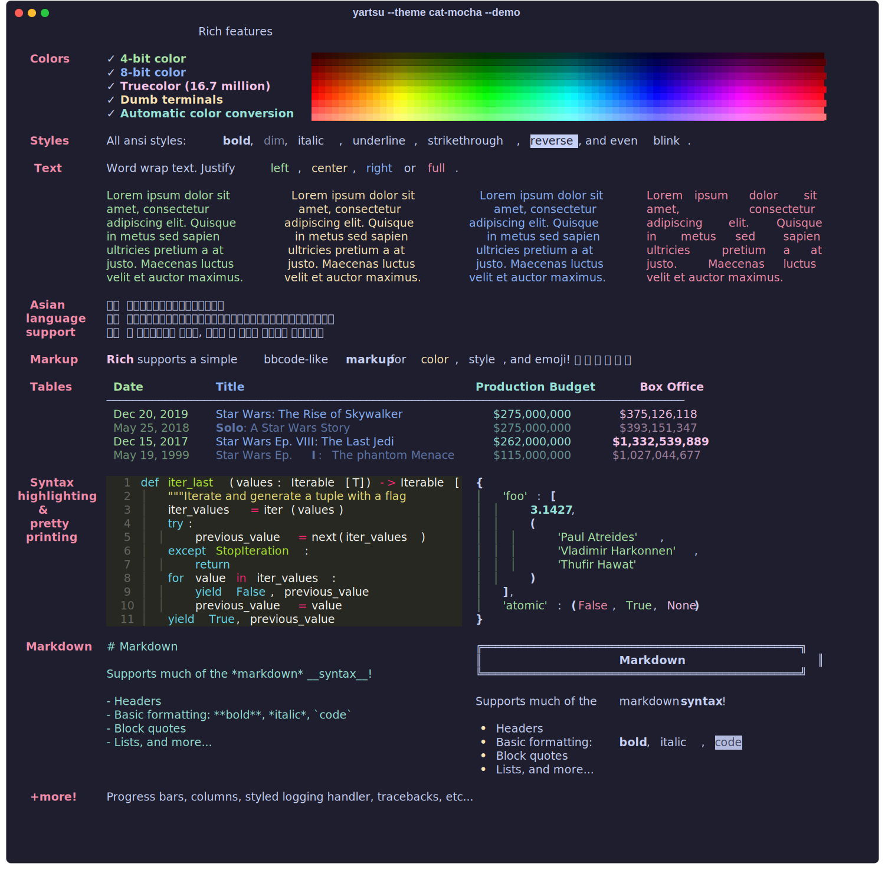
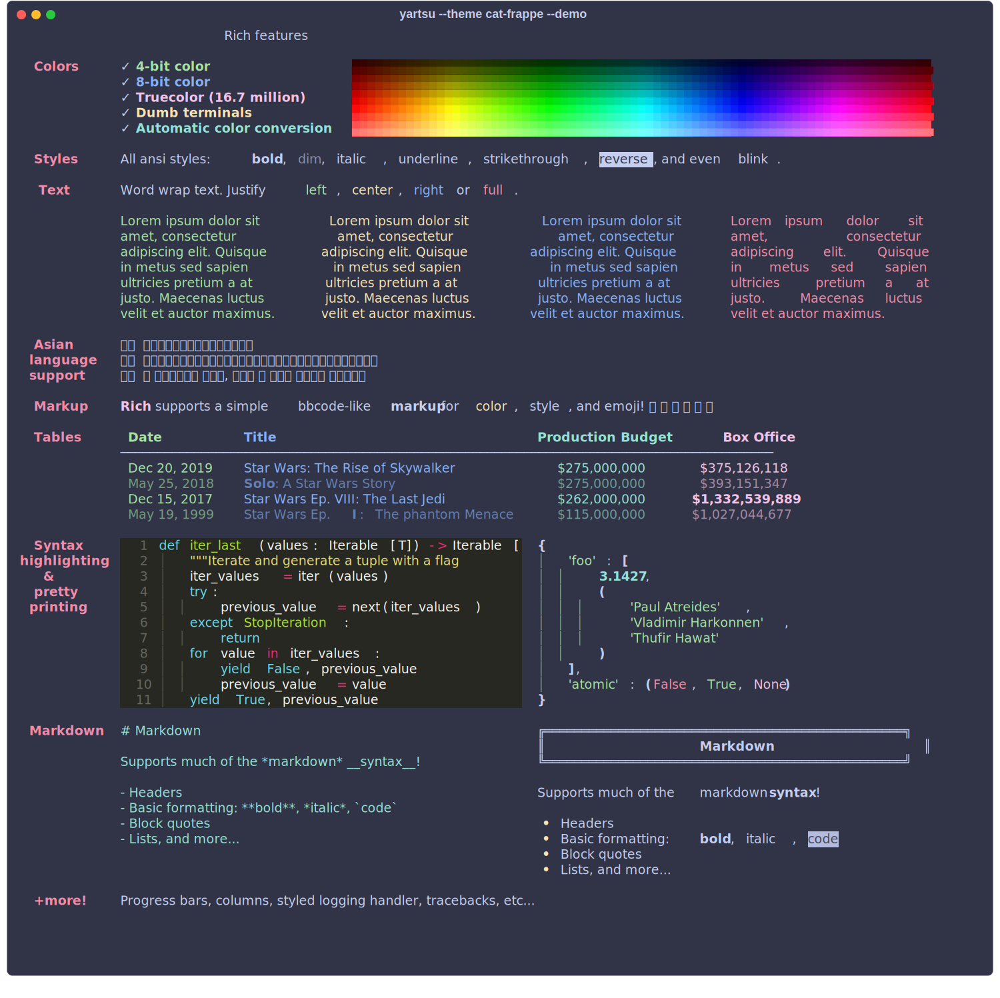
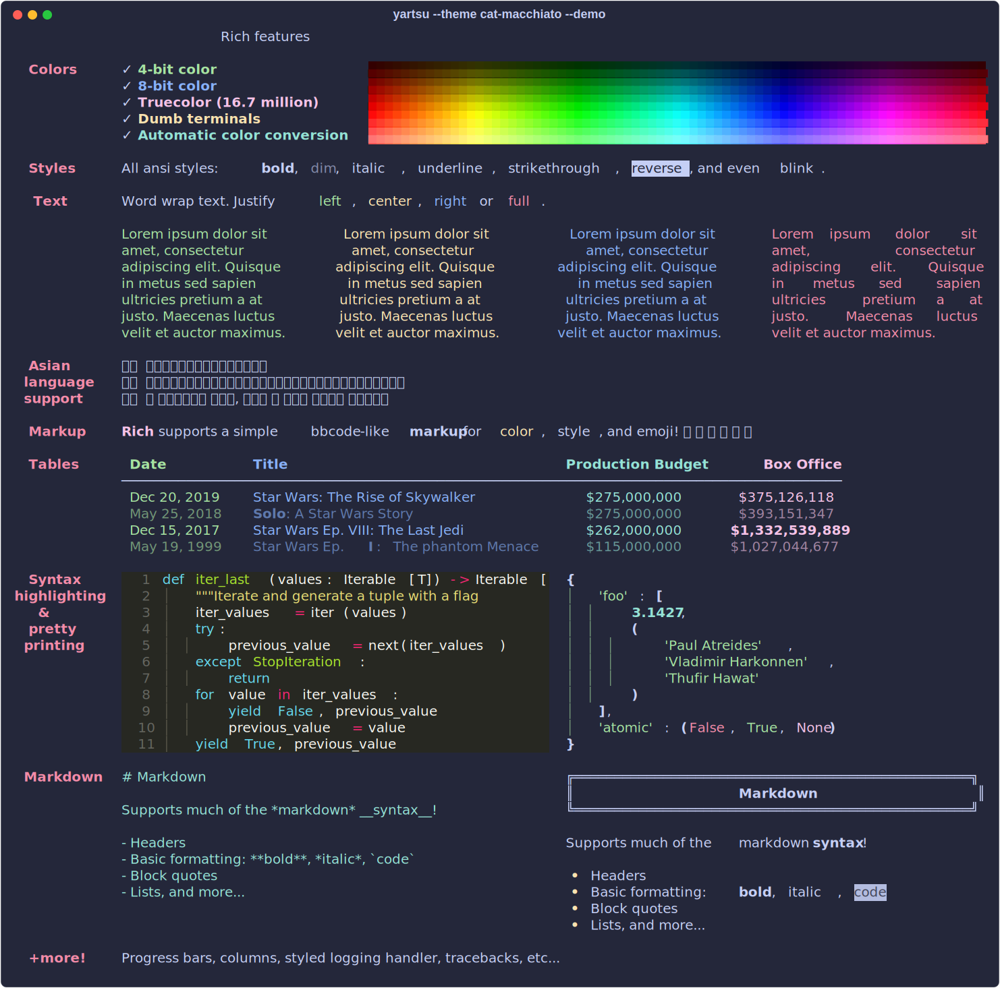
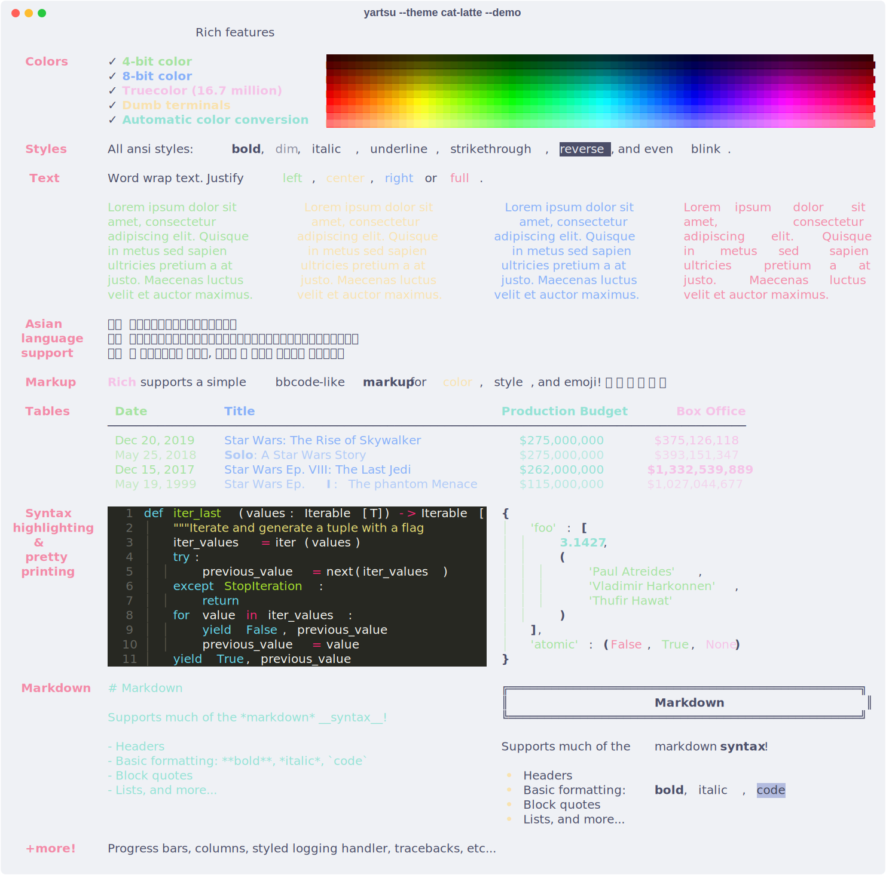
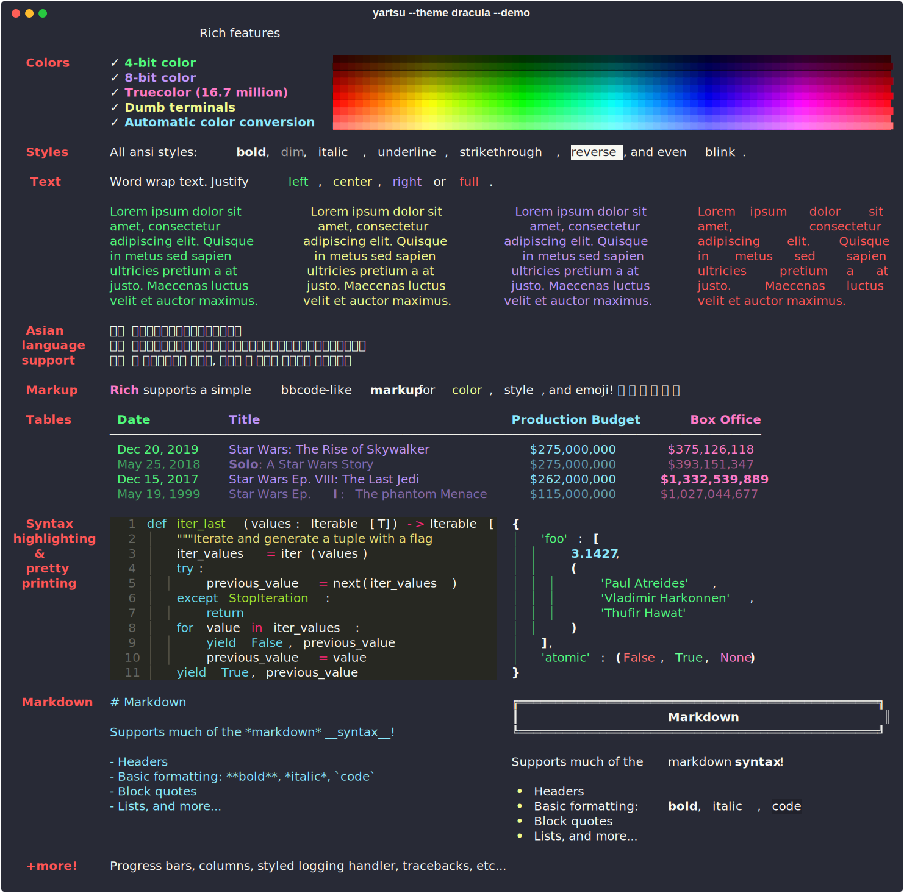
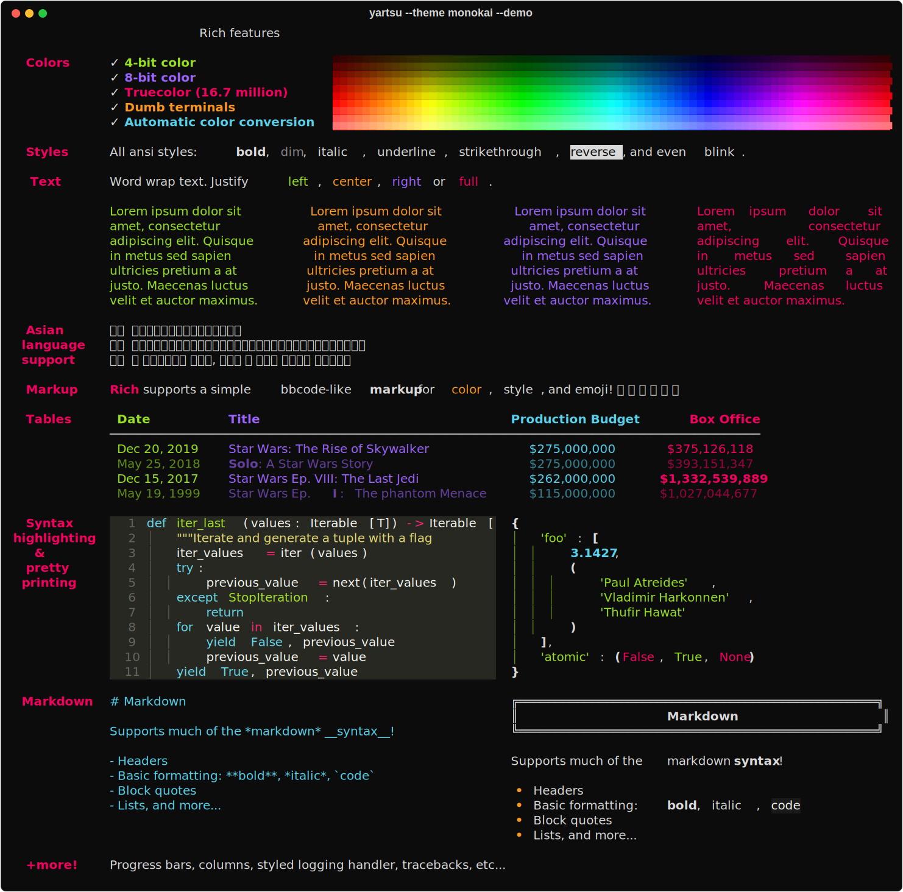
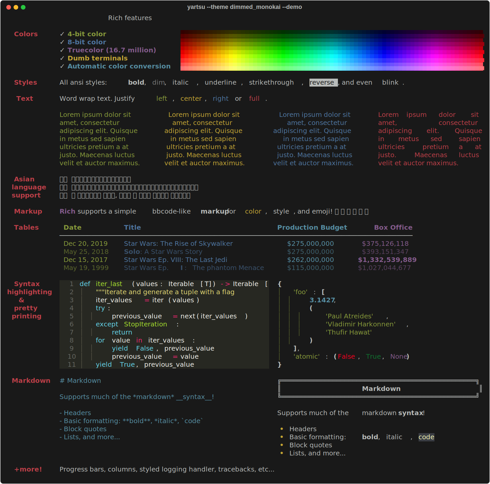
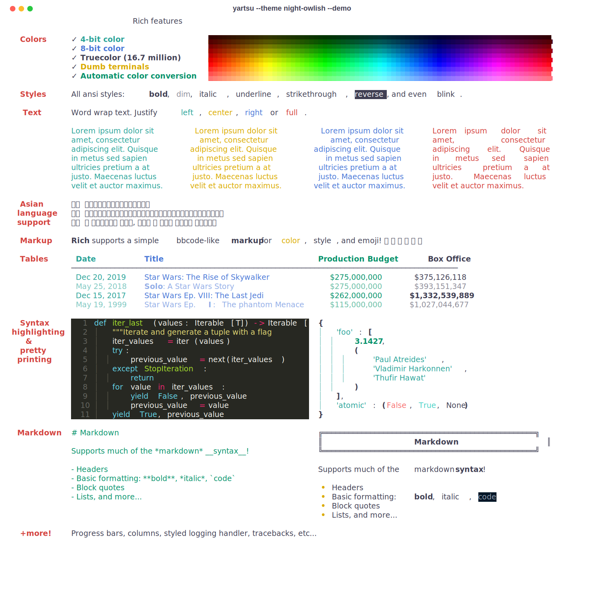
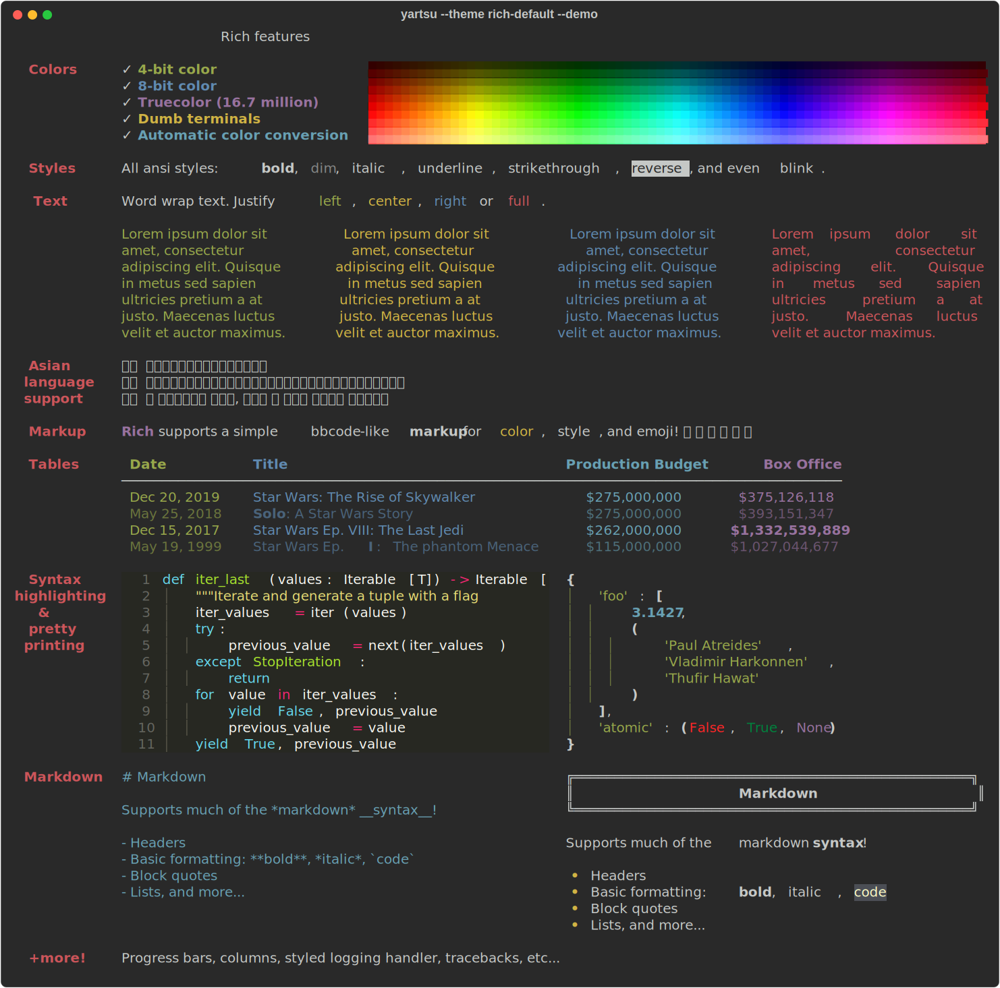

# Themes

 Available themes:
- [cat-mocha](#cat-mocha)
- [cat-frappe](#cat-frappe)
- [cat-macchiato](#cat-macchiato)
- [cat-latte](#cat-latte)
- [dracula](#dracula)
- [monokai](#monokai)
- [dimmed_monokai](#dimmedmonokai)
- [night-owlish](#night-owlish)
- [rich-default](#rich-default)

## cat-mocha

(<a href="#top">back to top</a>)

## cat-frappe

(<a href="#top">back to top</a>)

## cat-macchiato

(<a href="#top">back to top</a>)

## cat-latte

(<a href="#top">back to top</a>)

## dracula

(<a href="#top">back to top</a>)

## monokai

(<a href="#top">back to top</a>)

## dimmed_monokai

(<a href="#top">back to top</a>)

## night-owlish

(<a href="#top">back to top</a>)

## rich-default

(<a href="#top">back to top</a>)

