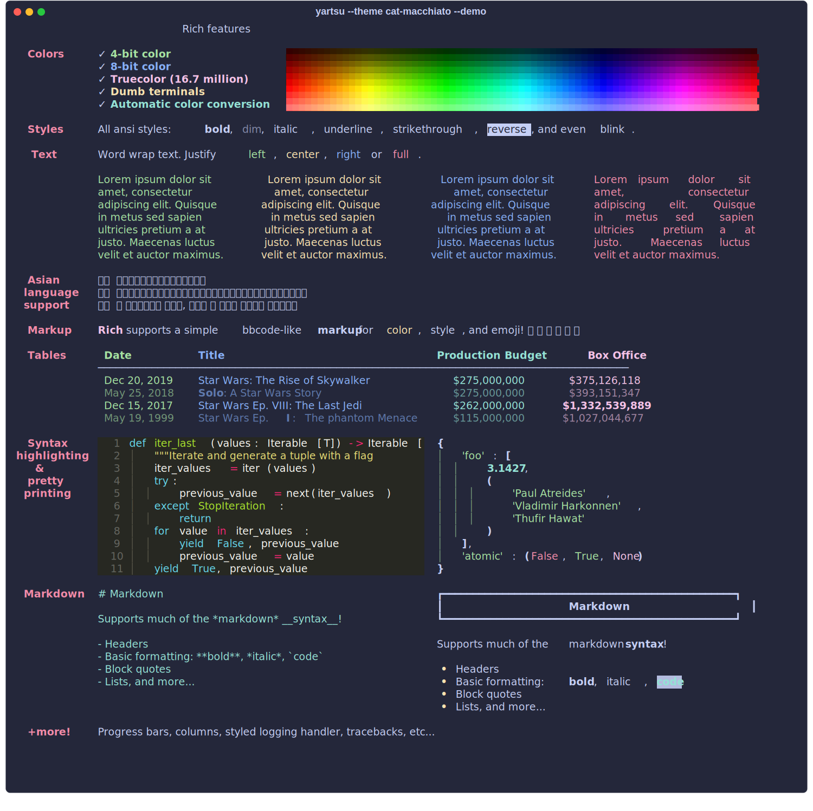

# Themes

See below for example outputs of each.
=== "cat-mocha"
    
=== "cat-macchiato"
    
=== "cat-frappe"
    
=== "cat-latte"
    
=== "dracula"
    
=== "gruvbox-dark"
    
=== "gruvbox-light"
    
=== "nord"
    
=== "dimmed_monokai"
    
=== "monokai"
    
=== "night-owlish"
    
=== "rich-default"
    
